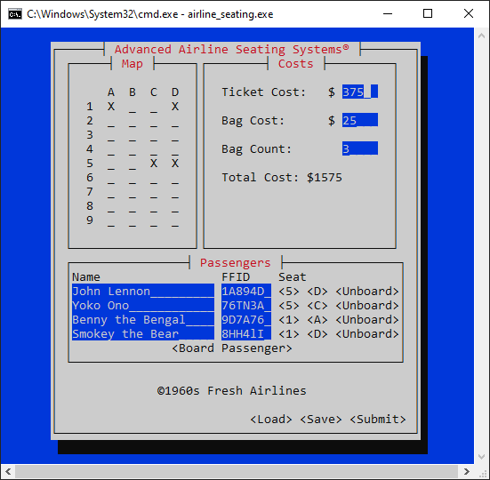

# Airline Seating
\
Airline assistant planning tool.

### Supported Platforms
* Should work out-of-the-box on Linux, macOS, and Windows. (Not tested on Linux or macOS).

### Features
* Dynamic map display.
* Dynamic costs display.
* Saving and loading flight arrangements in `json`.

### Inspiration
This project is inspired by a software specification by Dr. Bodily from Idaho State University.

### License

Licensed under the [MIT license](./LICENSE).
